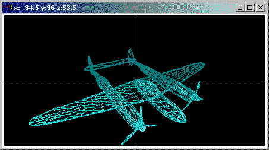



## A 3D Studio v6\.0 beta

### Description

Learn how to create your own 3D graphics library without using OpenGL or DirectX. This 3D application allows you to load DirectX data files into the application and view them in 3D. The virtual camera is centered on the origin (although you can change this). Use the mouse to move the virtual camera around the object. This 3D application uses a Right-Handed Coordinate system (as opposed to DirectX that uses a left-handed coordinate system). The 3D maths is based on industry recognized standards as found in 'Computer Graphics Principles and Practice, Foley*vanDam*Feiner*Hughes'. The 3D maths uses column-vector notation and is very stable; it won't change too much in the future, so this would be a good project to get familiar with. I've listed the code as intermediate as I don't think its too hard to follow. Comments are everywhere. For those of you familiar with my previous works (look them up), this one does not have any fancy music or animation as it's focus is somewhat more serious.
 
### More Info
 

             |
---                |---
**Submitted On**   |2003-12-27 01:59:18
**By**             |[Peter Wilson](https://github.com/Planet-Source-Code/PSCIndex/blob/master/ByAuthor/peter-wilson.md)
**Level**          |Intermediate
**User Rating**    |4.9 (78 globes from 16 users)
**Compatibility**  |VB 6\.0
**Category**       |[Graphics](https://github.com/Planet-Source-Code/PSCIndex/blob/master/ByCategory/graphics__1-46.md)
**World**          |[Visual Basic](https://github.com/Planet-Source-Code/PSCIndex/blob/master/ByWorld/visual-basic.md)
**Archive File**   |[A\_3D\_Studi168895112004\.zip](https://github.com/Planet-Source-Code/peter-wilson-a-3d-studio-v6-0-beta__1-50703/archive/master.zip)

